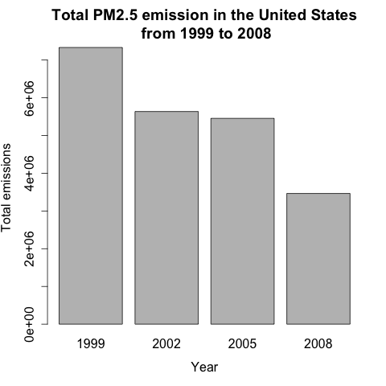
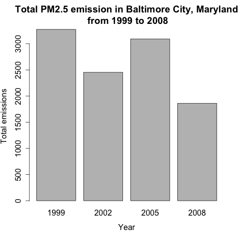
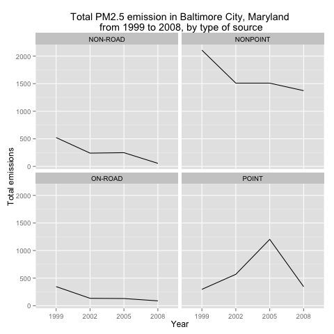
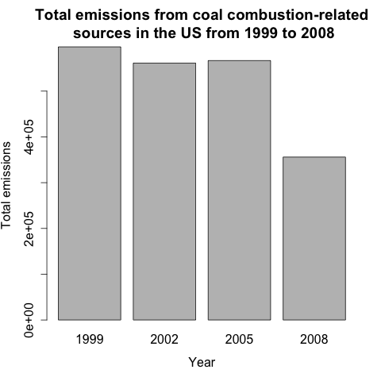
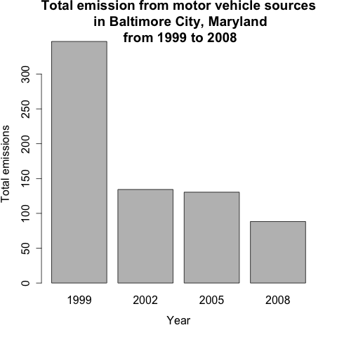
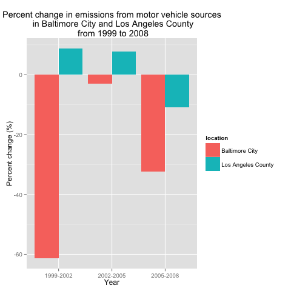

## A study of ambiant air pollutant in the US

The National Emissions Inventory (NEI) database is part of the Environmental Protection Agency (EPA). Approximatly every 3 years, the EPA releases its database on emissions of PM2.5. Complete information can be found 
<a href="http://www.epa.gov/ttn/chief/eiinformation.html" target="_blank">here</a>. 

A series of plots answering several questions constitute the bulk of this project. The code is included in the .R extension files, while the corresponding graph is saved as a .png document.

