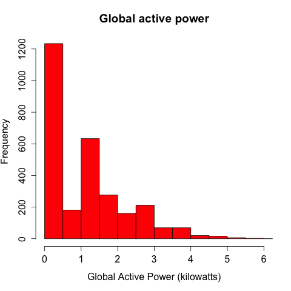
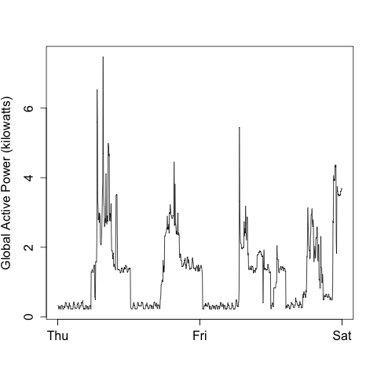
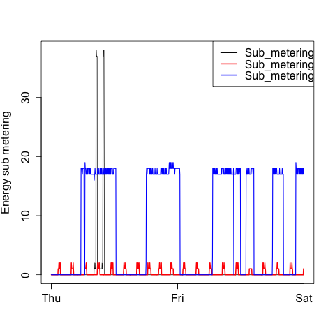
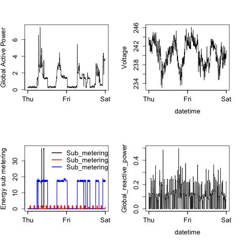

Making fun plots
===

This R code reads the electric power consumption data set from  the
<a href="http://archive.ics.uci.edu/ml/datasets/Individual+household+electric+power+consumption" target="_blank">UC Irvine Machine Learning Repository</a>, which contains 2,075,259 rows and 9 columns. For the purpose of this project, I read the data for the dates 2007-02-01 and 2007-02-02 and generate four plots.

